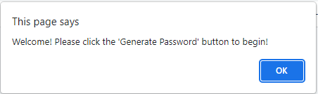
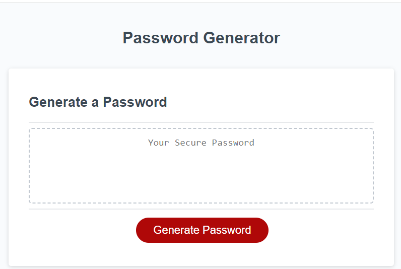
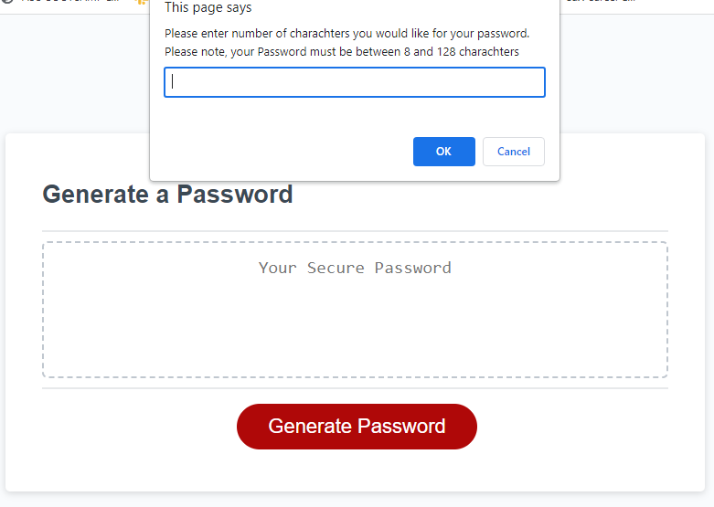
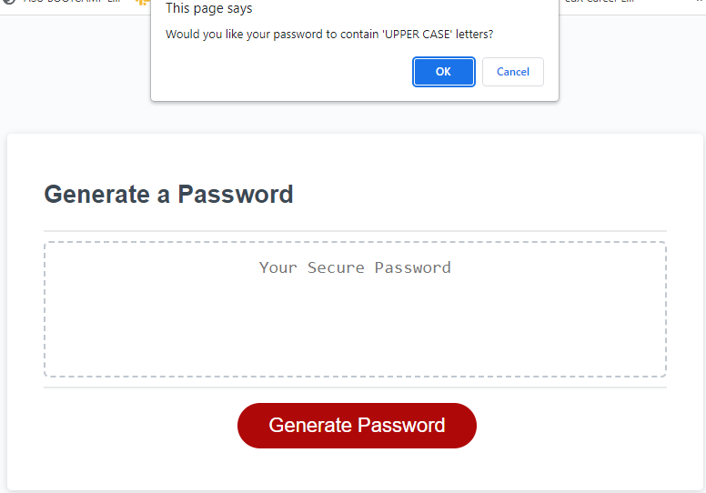
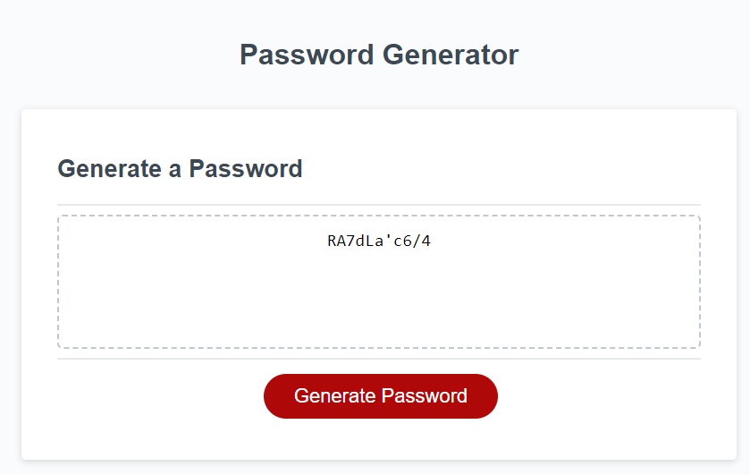

03-JavaScript-Password-Generator

User Story:

User will be able to generate a new, secure password

Clicking the Generate Password button will generate prompts to begin the process in generating the secure password

User will be prompted for password criteria including:

    -Charachter length between 8 and 128

    -Option to use UPPER CASE letters

    -Option to use lower case letters

    -Option to use numbers

    -Option to use special charachters

User will be required to select at least one character type in order to create their password

The secure password will be generated to match the selected criteria

The secure password will then be displayed on the screen

Technologies Used:

    -JavaScript
    -HTML
    -CSS

The following screenshots show the password generator's appearance and functionality:

Live GitHub Link: https://wht-rbt.github.io/03-JavaScript-Password-Generator/

GitHub Repository: https://github.com/WHT-RBT/03-JavaScript-Password_Generator

Lavina Castillo
- - -
Confidential and Proprietary. All Rights Reserved.
